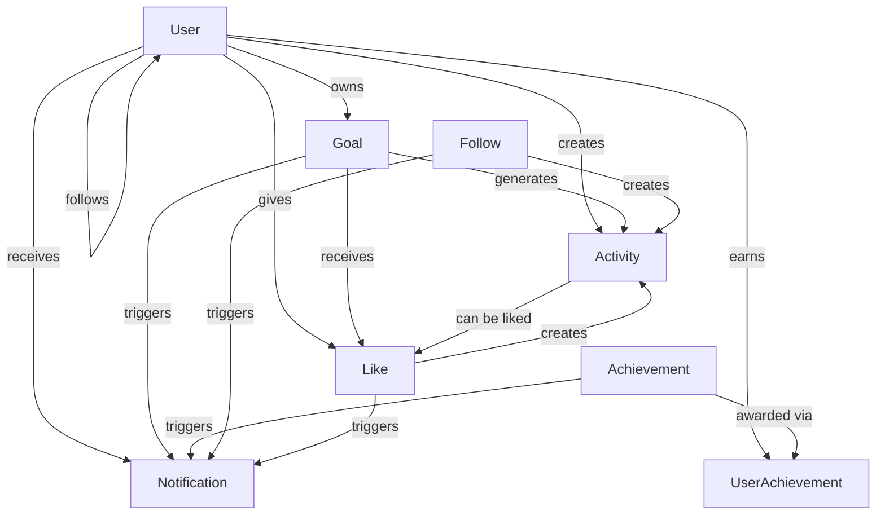

# WishTrail Database Schemas

Complete documentation of all database schemas for the WishTrail application.

## 📊 **Schema Overview**

| Schema | Purpose | Collections | Priority |
|--------|---------|-------------|----------|
| **User** | User management, authentication, gamification | `users` | ✅ Core |
| **Goal** | Goal management, progress tracking, points | `goals` | ✅ Core |
| **Activity** | Activity feeds, user timeline | `activities` | 🔥 High |
| **Follow** | Social relationships, following system | `follows` | 🔥 High |
| **Like** | Content engagement, likes system | `likes` | 🔥 High |
| **Notification** | User notifications, alerts | `notifications` | 📋 Medium |
| **Achievement** | Badges, milestones, gamification | `achievements` | 📋 Medium |
| **UserAchievement** | User-achievement junction table | `userachievements` | 📋 Medium |

---

## 🎯 **CORE SCHEMAS**

### **1. User Schema**

**Collection**: `users`  
**Purpose**: User management, authentication, profile, and gamification

```javascript
{
  // === IDENTITY ===
  name: String (required, max 100 chars, indexed)
  email: String (required, unique, indexed)
  password: String (required, min 6 chars, select: false)
  
  // === PROFILE ===
  avatar: String (default: DiceBear API)
  bio: String (max 500 chars, text index)
  location: String (max 100 chars, text index)
  
  // === SOCIAL LINKS ===
  socialLinks: {
    website: String (URL validation)
    youtube: String (YouTube URL validation)
    instagram: String (Instagram URL validation)
  }
  
  // === GAMIFICATION ===
  totalPoints: Number (default: 0, indexed desc)
  level: String (enum: Novice→Master, indexed)
  totalGoals: Number (default: 0)
  completedGoals: Number (default: 0, indexed desc)
  currentStreak: Number (default: 0)
  longestStreak: Number (default: 0)
  
  // === SOCIAL ===
  followers: [ObjectId ref User]
  following: [ObjectId ref User]
  
  // === ACTIVITY TRACKING ===
  dailyCompletions: Map<String, Array> // Date → completions
  
  // === ACCOUNT ===
  isActive: Boolean (default: true, indexed)
  isVerified: Boolean (default: false)
  lastLogin: Date (default: now)
  
  // === SECURITY ===
  passwordResetToken: String
  passwordResetExpires: Date
  emailVerificationToken: String
  emailVerificationExpires: Date
  
  timestamps: true
}
```

**Key Indexes**:
- `{ email: 1 }` (unique)
- `{ totalPoints: -1 }`
- `{ completedGoals: -1 }`
- `{ name: "text", bio: "text", location: "text" }`

**Key Methods**:
- `comparePassword()` - Password verification
- `generateAuthToken()` - JWT token generation
- `getTodayCompletionCount()` - Daily completion tracking
- `addDailyCompletion()` - Add completion record
- `getLeaderboard()` - Static leaderboard query
- `searchUsers()` - Static user search

---

### **2. Goal Schema**

**Collection**: `goals`  
**Purpose**: Goal management, progress tracking, points calculation

```javascript
{
  // === BASIC INFO ===
  title: String (required, max 200 chars, text index)
  description: String (max 1000 chars, text index)
  
  // === CLASSIFICATION ===
  category: String (enum: 10 categories, indexed)
  priority: String (enum: low/medium/high, indexed)
  duration: String (enum: short/medium/long-term, indexed)
  
  // === TIME MANAGEMENT ===
  targetDate: Date (required, future date, indexed)
  year: Number (required, 2020-2030, indexed)
  
  // === COMPLETION ===
  completed: Boolean (default: false, indexed)
  completedAt: Date (indexed desc)
  completionNote: String (max 1000 chars, min 10 words when completed)
  canCompleteAfter: Date (duration enforcement, indexed)
  
  // === OWNERSHIP ===
  userId: ObjectId ref User (required, indexed)
  
  // === SOCIAL ===
  likes: [{ userId: ObjectId, likedAt: Date }]
  likeCount: Number (default: 0, indexed desc)
  
  // === GAMIFICATION ===
  pointsEarned: Number (default: 0)
  
  // === STATUS ===
  isActive: Boolean (default: true, indexed)
  
  timestamps: true
}
```

**Key Indexes**:
- `{ userId: 1, year: 1 }`
- `{ userId: 1, completed: 1 }`
- `{ completed: 1, completedAt: -1 }`
- `{ title: "text", description: "text" }`

**Key Methods**:
- `calculatePoints()` - Complex points calculation
- `getPointsBreakdown()` - Points breakdown details
- `getRecentActivities()` - Static recent activities
- `getUserGoalsByYear()` - Static user goals by year
- `getUserStats()` - Static user statistics aggregation

---

## 🔥 **HIGH PRIORITY SCHEMAS**

### **3. Activity Schema**

**Collection**: `activities`  
**Purpose**: Activity feeds, user timeline, social engagement

```javascript
{
  // === CORE ===
  userId: ObjectId ref User (required, indexed)
  type: String (enum: 8 activity types, indexed)
  
  // === FLEXIBLE DATA ===
  data: {
    goalId: ObjectId ref Goal
    goalTitle: String
    goalCategory: String
    pointsEarned: Number
    targetUserId: ObjectId ref User
    targetUserName: String
    newLevel: String
    oldLevel: String
    streakCount: Number
    achievementId: ObjectId ref Achievement
    achievementName: String
    metadata: Map<String, Mixed>
  }
  
  // === VISIBILITY ===
  isPublic: Boolean (default: true, indexed)
  isActive: Boolean (default: true, indexed)
  
  timestamps: true
}
```

**Activity Types**:
- `goal_completed`, `goal_created`, `user_followed`
- `level_up`, `streak_milestone`, `achievement_earned`
- `goal_liked`
<!-- `profile_updated` -->

**Key Methods**:
- `createActivity()` - Static activity creation
- `getRecentActivities()` - Recent public activities
- `getUserActivities()` - User-specific activities
- `getFollowingActivities()` - Following users' activities

---

### **4. Follow Schema**

**Collection**: `follows`  
**Purpose**: Social relationships, following system

```javascript
{
  // === RELATIONSHIP ===
  followerId: ObjectId ref User (required, indexed)
  followingId: ObjectId ref User (required, indexed)
  
  // === STATUS ===
  isActive: Boolean (default: true, indexed)
  notificationsEnabled: Boolean (default: true)
  followedAt: Date (default: now)
  
  timestamps: true
}
```

**Key Indexes**:
- `{ followerId: 1, followingId: 1 }` (unique)
- `{ followingId: 1, isActive: 1, createdAt: -1 }`

**Key Methods**:
- `followUser()` - Static follow user
- `unfollowUser()` - Static unfollow user
- `isFollowing()` - Check follow status
- `getFollowers()` / `getFollowing()` - Get relationships
- `getMutualFollowers()` - Mutual connections
- `getSuggestedUsers()` - Follow suggestions

---

### **5. Like Schema**

**Collection**: `likes`  
**Purpose**: Content engagement, likes system

```javascript
{
  // === CORE ===
  userId: ObjectId ref User (required, indexed)
  targetType: String (enum: goal/activity/user, indexed)
  targetId: ObjectId (required, indexed)
  
  // === STATUS ===
  isActive: Boolean (default: true, indexed)
  reactionType: String (enum: like/love/celebrate/support/inspire)
  
  timestamps: true
}
```

**Key Indexes**:
- `{ userId: 1, targetType: 1, targetId: 1 }` (unique)
- `{ targetType: 1, targetId: 1, isActive: 1 }`

**Key Methods**:
- `likeItem()` / `unlikeItem()` - Like/unlike actions
- `toggleLike()` - Toggle like status
- `hasUserLiked()` - Check like status
- `getLikeCount()` - Get like count
- `getPopularItems()` - Most liked items
- `getTrendingItems()` - Trending content

---

## 📋 **MEDIUM PRIORITY SCHEMAS**

### **FeatureFlag Schema**

Collection: `featureflags`  
Purpose: Centralized feature toggles per platform (web/app)

```javascript
{
  key: String (required, unique, lowercase)
  description: String
  app: Boolean (default: true)
  web: Boolean (default: true)
  rollout: String (enum: ['off','beta','on'], default: 'on')
  audience: String (enum: ['all','staff','beta','none'], default: 'all')
  timestamps: true
}
```

Initial keys: `journal`, `habits`, `leaderboard`, `community`, `goal_division`, `stories`.

### **6. Notification Schema**

**Collection**: `notifications`  
**Purpose**: User notifications, alerts, engagement

```javascript
{
  // === CORE ===
  userId: ObjectId ref User (required, indexed)
  type: String (enum: 11 notification types, indexed)
  title: String (required, max 100 chars)
  message: String (required, max 500 chars)
  
  // === FLEXIBLE DATA ===
  data: {
    followerId: ObjectId ref User
    followerName: String
    goalId: ObjectId ref Goal
    goalTitle: String
    achievementId: ObjectId ref Achievement
    newLevel: String
    streakCount: Number
    likerId: ObjectId ref User
    // ... more notification-specific data
  }
  
  // === STATUS ===
  isRead: Boolean (default: false, indexed)
  isDelivered: Boolean (default: false)
  
  // === DELIVERY ===
  channels: {
    inApp: Boolean (default: true)
    email: Boolean (default: false)
    push: Boolean (default: false)
  }
  deliveredAt: Date
  readAt: Date
  
  // === EXPIRATION ===
  expiresAt: Date (30 days, TTL index)
  priority: String (enum: low/medium/high/urgent)
  
  timestamps: true
}
```

**Notification Types**:
- `new_follower`, `goal_liked`, `goal_reminder`
- `achievement_earned`, `level_up`, `streak_milestone`
- `friend_completed_goal`, `goal_due_soon`, etc.

---

### **7. Achievement Schema**

**Collection**: `achievements`  
**Purpose**: Badges, milestones, gamification system

```javascript
{
  // === BASIC INFO ===
  name: String (required, unique, max 100 chars)
  description: String (required, max 500 chars)
  icon: String (required, default: 🏆)
  
  // === CLASSIFICATION ===
  type: String (enum: 8 types, indexed)
  rarity: String (enum: common→legendary, indexed)
  
  // === CRITERIA ===
  criteria: {
    streakDays: Number
    pointsRequired: Number
    categoryGoalsRequired: Number
    targetCategory: String
    followersRequired: Number
    totalGoalsRequired: Number
    accountAgeRequired: Number
    specialConditions: Map
  }
  
  // === REWARDS ===
  rewards: {
    points: Number (default: 0)
    title: String
    badge: String
    unlockables: [String]
  }
  
  // === PROPERTIES ===
  isActive: Boolean (default: true, indexed)
  isSecret: Boolean (default: false)
  isRepeatable: Boolean (default: false)
  displayOrder: Number (indexed)
  totalEarned: Number (default: 0)
  
  timestamps: true
}
```

**Achievement Types**:
- `streak`, `category`, `points`, `social`
- `special`, `completion`, `milestone`, `time`

---

### **8. UserAchievement Schema**

**Collection**: `userachievements`  
**Purpose**: User-achievement junction table

```javascript
{
  // === CORE ===
  userId: ObjectId ref User (required, indexed)
  achievementId: ObjectId ref Achievement (required, indexed)
  earnedAt: Date (default: now, indexed desc)
  
  // === PROGRESS ===
  progress: Number (0-100, default: 100)
  progressData: {
    pointsWhenEarned: Number
    goalsCompletedWhenEarned: Number
    streakWhenEarned: Number
    followersWhenEarned: Number
    categoryProgress: Map<String, Number>
    // ... historical tracking
  }
  
  // === STATUS ===
  notificationSent: Boolean (default: false)
  occurrenceNumber: Number (default: 1, for repeatable)
  
  timestamps: true
}
```

**Key Indexes**:
- `{ userId: 1, achievementId: 1, occurrenceNumber: 1 }` (unique)
- `{ userId: 1, earnedAt: -1 }`

---

## 🔗 **SCHEMA RELATIONSHIPS**



---

## 📈 **PERFORMANCE OPTIMIZATIONS**

### **Strategic Indexing**

1. **Single Field Indexes**
   - Primary lookups: `email`, `userId`, `targetId`
   - Sorting: `createdAt`, `totalPoints`, `completedGoals`
   - Filtering: `isActive`, `completed`, `type`

2. **Compound Indexes**
   - User goals: `{ userId: 1, year: 1 }`
   - Activity feeds: `{ userId: 1, createdAt: -1 }`
   - Social queries: `{ followerId: 1, followingId: 1 }`

3. **Text Indexes**
   - Search functionality: `{ name: "text", bio: "text" }`
   - Goal search: `{ title: "text", description: "text" }`

4. **TTL Indexes**
   - Auto-cleanup: `{ expiresAt: 1 }`

### **Query Patterns**

- **Leaderboards**: Aggregation pipelines with sorting
- **Activity Feeds**: Time-based queries with population
- **User Search**: Text search with filtering
- **Social Feeds**: Following-based activity queries

---

## 🚀 **SCALABILITY FEATURES**

### **Horizontal Scaling**
- **Sharding Keys**: `userId` for user-centric collections
- **No Cross-Document Transactions**: Each schema is self-contained
- **Denormalized Counters**: `likeCount`, `totalPoints`, `completedGoals`

### **Performance Monitoring**
- **Query Hints**: Strategic index usage
- **Aggregation Optimization**: Efficient pipeline stages
- **Connection Pooling**: MongoDB connection management

### **Data Archival**
- **TTL Indexes**: Automatic cleanup of old data
- **Soft Deletes**: `isActive` flags for data retention
- **Partitioning**: Year-based goal partitioning

---

## 🔮 **FUTURE EXTENSIBILITY**

### **Ready for Scale**
- **Flexible Data Fields**: Map objects for extensibility
- **Polymorphic Relationships**: `targetType` + `targetId` pattern
- **Event-Driven Architecture**: Activity creation hooks
- **Microservices Ready**: Self-contained domain models

### **Planned Enhancements**
- **Real-time Features**: WebSocket integration points
- **Analytics**: Aggregation-ready data structure
- **Multi-tenancy**: Organization/team support
- **Content Moderation**: Report/flag system integration

---

This schema design supports:
- ✅ **Current Frontend Features**: All existing functionality
- 🚀 **High Performance**: Optimized for common queries
- 📈 **Scalability**: Horizontal scaling capability
- 🔮 **Future Growth**: Extensible architecture
- 🛡️ **Data Integrity**: Comprehensive validation
- 🎯 **User Experience**: Real-time updates and notifications 